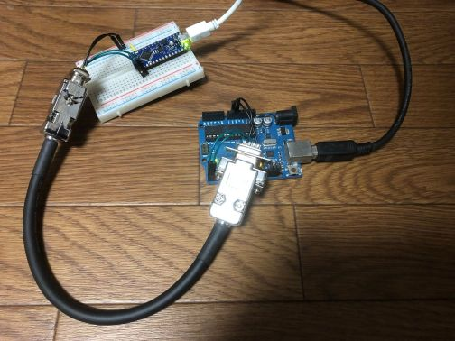

<!-- 
マイコン間のUART通信距離
==========================
 -->

マイコン間のシリアル通信を、**ドライバICなし**で**少ない配線数**で実現できないかと検討しており、UART通信の通信可能距離を測定してみました。

UART通信[^1]は、通常単一機器内のデバイス間通信で使われ、想定される通信距離はせいぜい数10 cmとのことです。RS232Cに変換すれば規格上15 mまで距離が伸びますが、ドライバICが必要になります。設計中回路のスペースの都合で、できればドライバICを使わずに済ませたいです。

[^1]: UART（Universal Asynchronous Receiver Transmitter）は調歩同期式シリアル通信のひとつ。規格ではなく、本来はシリアル信号をパラレル信号に変換したりその逆を行ったりするための集積回路のこと。RS-232Cは電圧などを規定した物理層の規格で、通信方式自体はUARTと同じ。


セットアップ
------------

### 配線

| Arduino Nano Every | D-sub 9ピンケーブル | Arduino UNO R3 |
| :----------------: | :-----------------: | :------------: |
|         TX         |          1          |       RX       |
|         RX         |          3          |       TX       |
|        GND         |         2,4         |      GND       |

使用するD-subケーブルは、ツイストペアケーブルを使ったもので (1,2) と (3,4) がペアになっています。信号とGNDをペアにすることで、ノイズに強くなって通信距離が延びることを期待。手元にあったマイコンがUNO R3とNano Everyだったので、この2つを使っています。KB2040もありましたが、UNOとNano Everyが5 Vなのに対してKB2040は3.3Vなので、今回は出番なし。設計中のマイコン回路は5 Vで動かす予定なので、通信距離も5 Vでテストします。



- [Nano Everyピン配置](UART-distance/NanoEvery_pinout.pdf)
- [Uno R3ピン配置](UART-distance/Uno_pinout.pdf)

### 手順

両マイコンボードに後述する実験用コードを書き込み、まずは短い配線で正しくコードが動くかテストします。問題なければ、手元にあるD-subケーブル（長さ0.3 m, 1.5 m, 3.0 m）を使って通信距離をテストします。


実験用コード
------------

Nano Everyから`Ultra soul!`を送り、それを受け取ったらUnoから`Hi!!`を返すようにします。Nano EveryはPCともシリアル通信をして、送る信号と受け取る信号をPC上に表示します[^2]。`baudrate`を9600, 19200, 38400, 115200といった具合に順に大きくしてコンパイルし、通信できるかどうかを確認します。

[^2]: Uno R3はTX, RX端子のシリアル通信とPCとのシリアル通信が同じ信号なので、他のマイコンとPCとの通信を同時に行うと予期せぬ挙動をする恐れがあります。Nano Everyは、PCとの通信とTX, RX端子の通信は独立に動きます。Uno側でソフトウェアシリアルを使うという手もありますが、今回はNano EveryをPCに接続する構成にします。


### Nano Every用

```c++
const long baudrate = 9600;  // テストbaud rateの設定

void setup() {
  Serial.begin(115200);  // PCとのシリアル通信の初期化
  Serial1.begin(baudrate);  // TX/RX端子のUART通信の初期化
}

void loop() {
  Serial.println("Ultra soul!");  // PCに表示
  Serial1.println("Ultra soul!");  // Unoへの送信
  delay(1500);

  // 受信データが存在する場合にwhileに入る
  while (Serial1.available() > 0) {
    Serial.println(Serial1.readStringUntil("\n"));  // 受診したデータを改行文字まで読みPCに送信
  }

  delay(500);
}
```

### Uno R3用

```c++
const long baudrate = 9600;  // テストbaud rateの設定

void setup() {
  Serial.begin(baudrate);  // TX/RX端子のUART通信の初期化
}

void loop() {
  // 受信データが存在する場合にwhileに入る
  while (Serial.available() > 0) { 
    String recieved = Serial.readStringUntil("\n");  // 受診したデータを改行文字まで読み
    recieved.trim();  // 不要な空白、改行文字を削除
    // 受信データが"Ultra soul!"に一致する場合に"Hi!!"をNano Everyに返信
    if (recieved == "Ultra soul!") {
      Serial.println("Hi!!");
    }
  }
}
```


### 落とし穴

UART通信のbaud rateを変数`baudrate`で設定しています。`Serial.begin()`の引数がlong型を取るのに対して、当初`baudrate`をint型で宣言してしまい、19200 bpsまでしか正しく動作しませんでした。int型は`-32768`から`32767`までしか表せず、38400 bpsなどを設定することができなかったというわけです。


結果
----

下の動画は通信の様子です。`Ultra soul!`と`Hi!!`のテンポが一定でないのは、録画側の問題のようです。



9600 bpsから2 Mbpsまで試して、通信できたかどうかを示します。手元にオシロスコープが無かったので、信号波形がどのように歪むかまでは確認していません。

| ケーブル長 (m) | 9600 bps | 19200 bps | 38400 bps | 115200 bps | 1 Mbps | 2 Mbps |
| :------------: | :------: | :-------: | :-------: | :--------: | :----: | :----: |
|      0.3       |    OK    |    OK     |     ―     |     ―      |   ―    |   ―    |
|      1.5       |    OK    |    OK     |    OK     |     OK     |   ―    |   ―    |
|      3.0       |    ―     |     ―     |     ―     |     OK     |   OK   |   NG   |

上述の落とし穴でハマっていたのもあって、試した長さと速度の組み合わせが規則的ではありませんが、とりあえず上のような結果でした。OKだった条件より短いケーブル、遅い通信速度なら問題ないはずです。1.5 mや0.3 mのケーブルで2 Mbpsを試すのを忘れましたが、実際に使うときは速くても115200 bpsくらいにする予定なので問題ないです。

意外と長いケーブルでも問題なく通信できました。

<!-- 
Memo
----

- Pro MicroはUSB CDC[^3] portを使うため、`Serial.begin()`でのBaud rateの設定は無関係。これらのポートとのシリアル通信には、任意のボーレートと構成を使用できる。

- Nano Everyは水晶発振器がついていないため、内蔵発振器の精度で律速される可能性がある。ただ、PCとNano Every間のシリアル通信は115200 bpsでも出来ている。

[^3]: Communications Device Class: USB上でデバイス間のデータのやりとりを行うための通信規格。PCからはRS-232Cのポートとして扱うことができる。通信速度の設定は9600 bps固定だが実際の通信速度は使用するUSBの規格に相当する。
 -->


参考資料
--------

- [UART (Wikipedia)](https://ja.wikipedia.org/wiki/UART)
- [UARTシリアル通信①：Arduino同士の通信](https://ameblo.jp/geotechlab-workshop/entry-12624606387.html)
- [Connecting Two Nano Every Boards Through UART](https://docs.arduino.cc/tutorials/nano-every/uart/)

