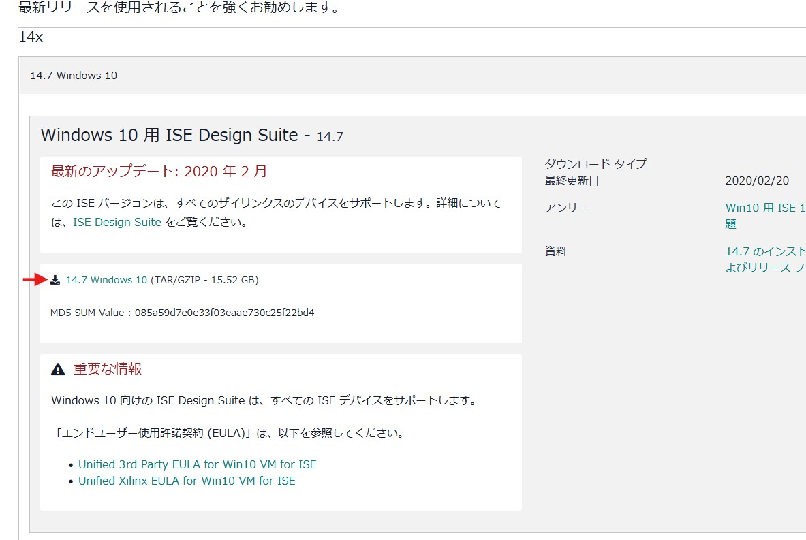
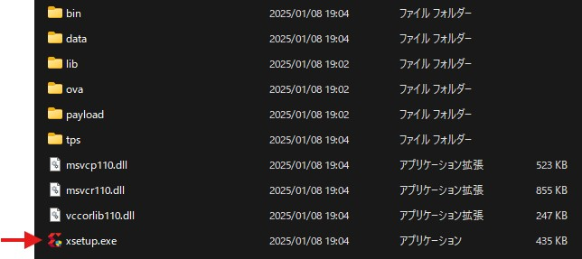
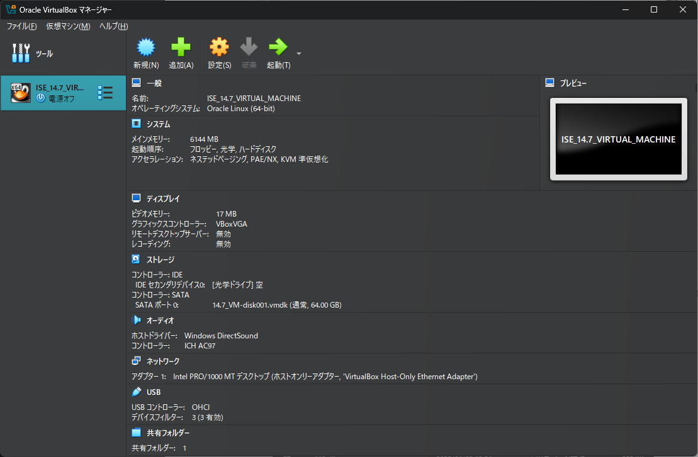
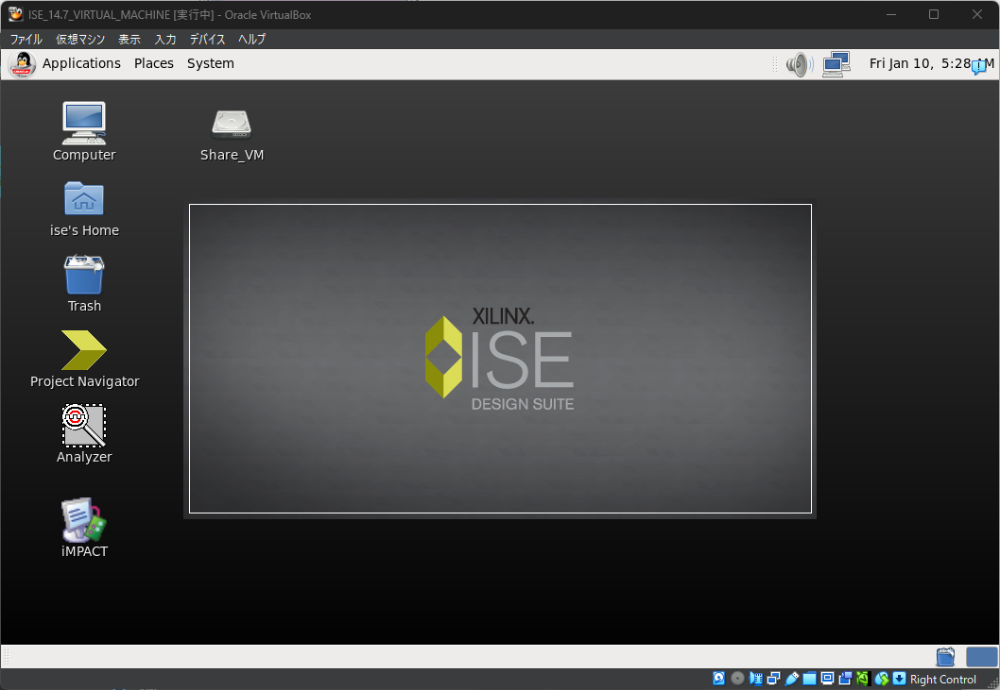
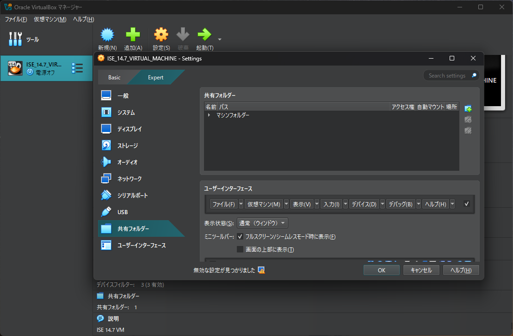
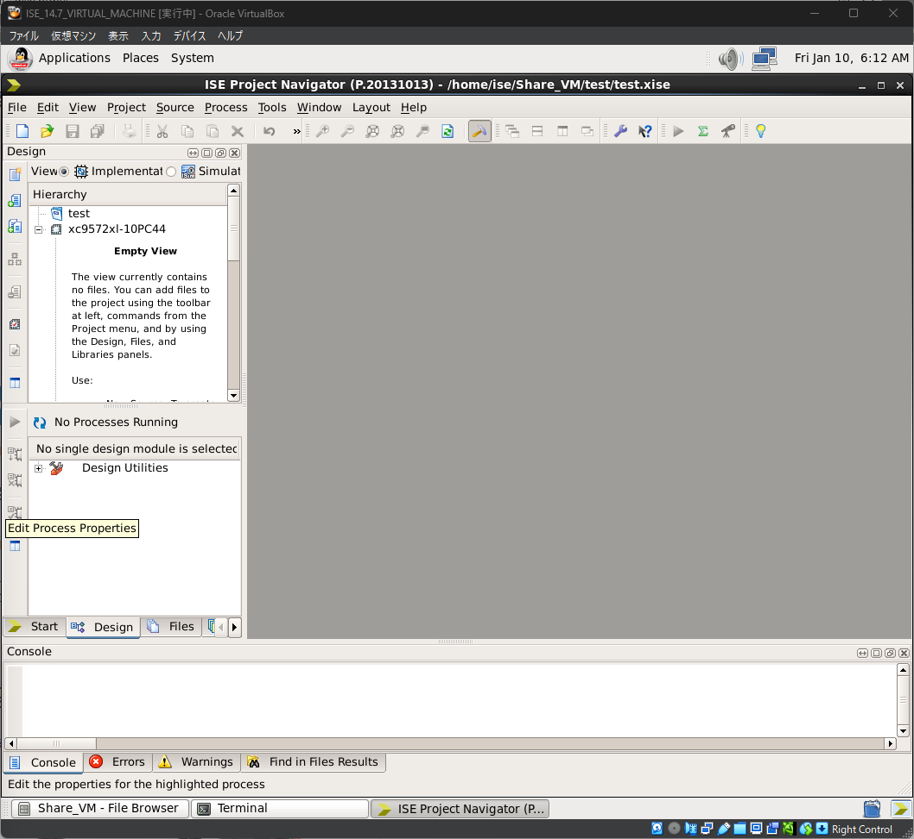
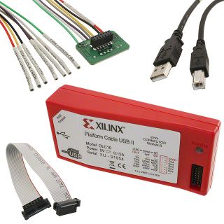
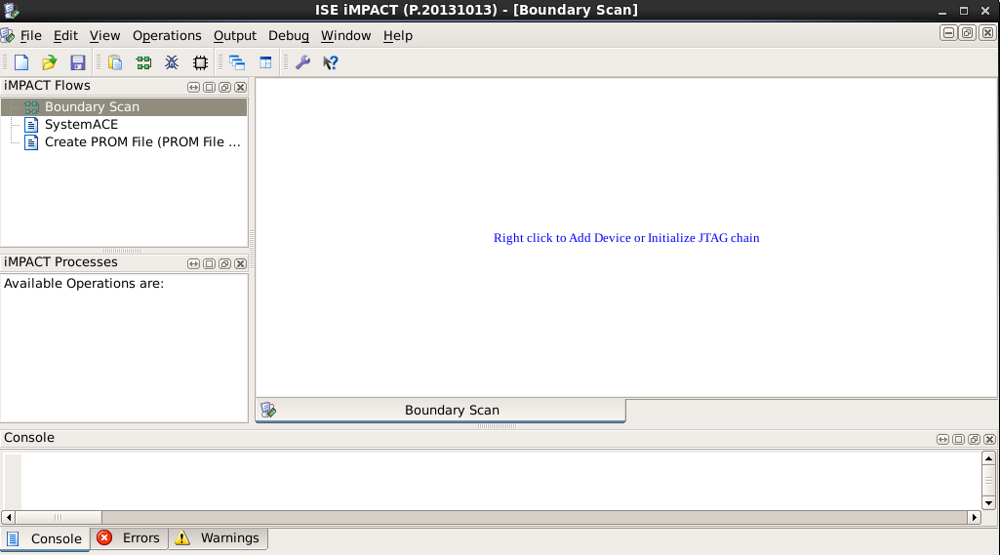

<!-- 
Xilinx ISE 14.7 最終版のインストールと書き込み
====================================
-->

研究室にはXilinxの古いCPLD、**XC9572XL**を結構在庫しており、これを使ってたまにデジタル位相比較器を作ったりします。先日も作ろうとしたところ、Windows 11では対応する開発環境**ISE**が動かないことが分かりました。色々調べてみると、ISEの最終版であるv14.7を仮想環境を使って動かせということらしいです。

というわけで、仮想環境のインストールからCPLDへの書き込みまでひと通りできるようにしたので、まとめておきます。

全体の流れ
----------

1. 開発環境（ISE）の準備
   1. Oracle VirtualBoxのインストール
   2. ISE 14.7 VM for windows 10のインストール
   3. 仮想環境とのファイル共有設定
2. Verilog HDLファイル（***.v）の作成
3. 制約ファイル（***.ufc）の作成
4. 基板との接続
5. プログラム

### 動作確認環境

|                  | 動作確認環境      |
| ---------------- | ----------------- |
| OS               | Windows 11 24H2   |
| CPU              | AMD Ryzen 7 8700F |
| CPLD             | XC9572XL          |
| 開発環境         | ISE 14.7 VM         |
| 書き込みケーブル | UW-USB-II-G       |

開発環境（ISE）の準備
---------------------

ISEの開発は執筆次点で既に終了しており、最終版（v14.7）を使用することになります。Windows 10以降のOSに対応するため、仮想環境内でISEを実行する仕様となっています。

### Oracle VirtualBoxのインストール

仮想環境を構築するために、あらかじめOracle VirtualBoxをインストールします。

- [VirtualBoxのダウンロードサイト](https://www.virtualbox.org/wiki/Downloads)

Windows用のインストーラをダウンロードし、インストールします。

### ISE 14.7 VM for windows 10のインストール

VirtualBoxをインストールしてから、ISE 14.7 VM for windows 10をインストールします。VirtualBoxがインストールされていないと、失敗するので注意して下さい。XilinxのISEアーカイブページから、ISE最終版のインストーラをダウンロードします。

ダウンロードにはXilinx (AMD)アカウントへのログインが必要になります。あらかじめ作成しておいて下さい。

- [ISEアーカイブ](https://japan.xilinx.com/downloadNav/vivado-design-tools/archive-ise.html)

ISEのインストーラはかなり大きなZIPファイルとなっています。ダウンロードしたZIPファイルを展開し、`xsetup.exe`を実行してインストールします。

インストール完了後、VirtualBoxを起動すると、ISE 14.7の仮想環境が既に設定された状態になっています。ISE 14.7を選択して起動すると、仮想環境でLinuxが起動します。Linuxデスクトップにある`Project Navigator`アイコンからISEを起動できます。

### 仮想環境とのファイル共有設定

VirtualBoxの仮想環境にファイルを転送する方法には、以下の2通りあります。

- クリップボードを共有する
- 共有フォルダを設定する

ところが、クリップボードを使う方法はなぜかうまくいきませんでした。なので、ここでは共有フォルダを設定する方法を説明します。

1. VirturalBoxを立ち上げ、ISE 14.7を選択
2. **設定 > 共有フォルダー**を選択

3. 右側の`共有フォルダー追加`ボタンをクリックし、ホスト側のフォルダのパス、フォルダ名を記入
4. オプションは`自動マウント`にチェック

これで、仮想環境を立ち上げるとLinuxデスクトップ上に共有フォルダアイコンが現れます。

新規プロジェクトの作成
----------------------

1. LinuxデスクトップでISEを起動し、メニューバーの**File > New Project**を選択します。
2. プロジェクト名、プロジェクトを作成するディレクトリ（デフォルトは自動設定）、ソースコードの種類を選択します。ソースコードのタイプは`HDL`を選択します。
3. **Project Settings**でデバイス情報などを入力します。ここでは使用するCPLDと言語に合わせて
   
   - Family: `XC9500XL CPLDs`
   - Device: `XC9572XL`
   - Package: `PC44`
   - Speed: `-10`
   - Preferred Language: `Verilog`
  
   と設定しました。他はデフォルトのままにしました。
4. **Project Summary**が表示されるので、確認して`Finish`を押します。

Verilog HDLファイル`***.v`の作成
---------------------------------

1. ISE Project NavigatorのHierarchyウィンドウで右クリックし、`Nwe Source`を選択します。`Verilog Module`を選んでファイル名を入力して`Next`を押します。

2. 各portの設定画面になるので、Port名、input/outputの方向などを入力して`Next`を押します。後で変更できるので、ここでは何も記入しなくても大丈夫です。
3. Verilog HDLファイルが作られるので、コードを編集します。

制約ファイル`***.ufc`の作成
-----------------------------

1. ISE Project NavigatorのHierarchyウィンドウで右クリックし、`Nwe Source`を選択します。`Implementation Constraints File`を選んでファイル名を入力して`Next`を押します。
2. 確認画面が出るので、`Finish`を選択すると制約ファイル`***.ufc`が作られます。これを編集して入出力を設定します[^1]。

[^1]: このバージョンのISEはPlanAheadには対応しておらず、GUIを使った制約ファイル（配線情報）を作成することはできません。直接コードを記述して下さい。

基板との接続
------------

ここでは純正のプログラマケーブル（UW-USB-II-G）を使用する場合について説明します。

以下のように接続します。接続するには、基板側の電源をONにする必要があります。

| UW-USB-II-G | 接続基板側JTAG |
| ----------- | -------------- |
| VREF        | VCC            |
| TCK         | TCK            |
| HALT        | 接続なし       |
| TDO         | TDO            |
| TDI         | TDI            |
| TMS         | TMS            |
| GND         | GND            |

内蔵メモリへの書き込み
----------------------

### コンパイル

ISE Project NavigatorのProcessesウィンドウの`Implement Design`で右クリックし、`Run`を実行します。

問題がなければ、`Translate`、`Fit`、`Generate Programming File`に緑チェックが付きます。

### 生成されたJEDファイルの書き込み

1. プログラマケーブルと基板を接続し、基板側の電源をONにします。
2. ISE Project NavigatorのProcessesウィンドウの`Configure Target Device`をダブルクリックすると、書き込み用アプリのiMPACTが起動します。
3. iMPACT Flowsウィンドウの中の`Boundary Scan`をダブルクリックします。現れたBoundary Scanウィンドウ内で右クリックし、`Initialize Chain`を選択すると、接続されたCPLDが表示されます。このとき、そのままConfigurationファイルをアサインするか聞かれるので、**Yes**を選択し、`***.jed`ファイルを選んで`Open`を押します。次のダイアログも、そのまま`OK`を押します。
4. Identify Succeededと表示されたら認識OKです。Boundary Scan内で右クリックし`Program`を選択すると、書き込みが開始されます。
5. Program Succeededと表示されたら書き込み完了です。

参考資料
--------

- [ISE 14.7 VMのインストール手順（英語）](program_xilinx_CPLD\ug1227-ise-vm-windows10.pdf)
